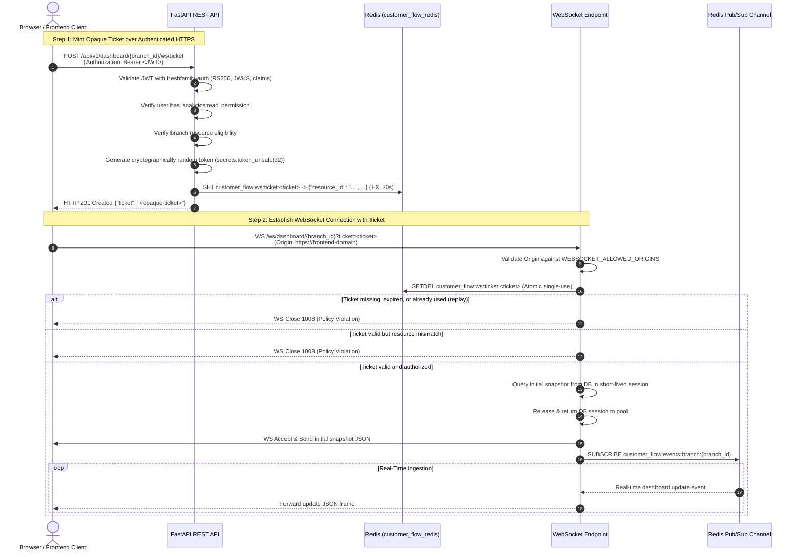

# Authentication & Authorization Architecture (`freshfamily-auth`)

## 1. Overview & Architecture

`customer-flow-backend` integrates the shared `freshfamily-auth` library to secure all REST API endpoints and WebSocket channels with enterprise-grade JWT/JWKS authentication.

### Authentication Flow Diagram

```mermaid
sequenceDiagram{}
    autonumber
    actor Client as Frontend / API Client
    participant API as FastAPI Backend (`customer-flow-backend`)
    participant JWKS as IDP JWKS Endpoint (`/.well-known/jwks`)
    participant DB as PostgreSQL

    Note over Client,API: Eager Prefetch at FastAPI startup
    API->>JWKS: GET /.well-known/jwks (Startup Lifespan)
    JWKS-->>API: Active Public RSA Keys (JSON Web Key Set)

    Note over Client,API: Authenticated Request Execution
    Client->>API: GET /api/v1/entries (Authorization: Bearer <JWT>)
    API->>API: Extract Bearer Token & Read header.kid
    alt Key in TTL Cache
        API->>API: Retrieve cached RSAPublicKey
    else Key not in Cache / Expired
        API->>JWKS: Fetch fresh JWKS with stampede lock
        JWKS-->>API: Updated Key Set
    end
    API->>API: Verify Signature (RS256 only)
    API->>API: Verify iss, aud, exp, iat, leeway (30s)
    API->>API: Map Claims -> TokenPayload (sub, roles, permissions)
    API->>API: Evaluate require_permission("entries:read")
    alt Authorized
        API->>DB: Query customer flow entries
        DB-->>API: Entry records
        API-->>Client: HTTP 200 OK + PaginatedEntriesResponse
    else Missing Permission
        API-->>Client: HTTP 403 Forbidden {"detail": "Missing permission: entries:read"}
    else Invalid / Expired Token
        API-->>Client: HTTP 401 Unauthorized {"detail": "<error_message>"}
    end
```

---

## 2. Token & JWKS Verification Engine

- **Algorithm Policy**: Strictly enforces `RS256`. Symmetric algorithms (HMAC) and `none` are disallowed.
- **Asynchronous Verification**: Request execution uses `decode_async` via `JwksClient`. No runtime PEM fallback is present, preventing rotated-out keys from being accepted.
- **JWKS Cache & Stampede Protection**: Public keys are cached for `AUTH_CACHE_TTL_SECONDS` (default: 3600s). Concurrent incoming requests are protected by an `asyncio.Lock` to prevent cache stampedes against the IDP.
- **Key Rotation Resilience**: On signature verification failure, `JwksClient` invalidates the local key cache and performs a single refresh fetch before rejecting the token.
- **Stale-On-Failure**: If a key refresh fails due to an IDP outage, existing cached keys are retained to prevent service downtime.
- **Clock Drift Tolerance**: `AUTH_LEEWAY` defaults to `30.0` seconds to absorb NTP synchronization variance between the IDP and microservice nodes.

---

## 3. Configuration & Environment Variables

All settings are configured through environment variables or `.env`:

| Environment Variable | Type | Default | Description |
| :--- | :--- | :--- | :--- |
| `JWKS_URL` | `string` | `None` | URL to the Identity Provider's JWKS endpoint (e.g. `https://idp.example.com/.well-known/jwks`). |
| `AUTH_ISSUER` | `string` | `None` | Expected JWT issuer (`iss` claim). Skips check if unset. |
| `AUTH_AUDIENCE` | `string` | `None` | Expected JWT audience (`aud` claim). Skips check if unset. |
| `AUTH_ALGORITHMS` | `list[str]` | `["RS256"]` | Approved cryptographic signing algorithms. |
| `AUTH_CACHE_TTL_SECONDS` | `float` | `3600.0` | Cache time-to-live for fetched JWKS keys. |
| `AUTH_FETCH_TIMEOUT_SECONDS` | `float` | `5.0` | HTTP request timeout for fetching the JWKS keyset. |
| `AUTH_ROTATION_RETRY` | `bool` | `true` | Invalidate cache and retry key resolution once on signature mismatch. |
| `AUTH_APP_ENV` | `string` | `production` | Environment mode (`production` or `development`). |
| `AUTH_DEV_BYPASS_ROLE` | `string` | `admin-dev` | Role allowed to bypass permission gates in development mode only. |
| `AUTH_LEEWAY` | `float` | `30.0` | Clock skew tolerance in seconds (production standard: 30.0s). |
| `AUTH_PUBLIC_KEY_PEM` | `string` | `None` | Static PEM public key (for offline test suites or CLI tasks only). |

---

## 4. Role & Permission Model

Permissions are defined in `app/core/permissions.py`:

```python
class Permission(str, Enum):
    ENTRIES_READ = "entries:read"
    WAITING_TIMES_READ = "waiting_times:read"
    ANALYTICS_READ = "analytics:read"
    ADMIN = "admin:all"
```

### Endpoint Security Inventory

| Endpoint | Method | Required Permission / Role | Classification | Description |
| :--- | :--- | :--- | :--- | :--- |
| `/health` | `GET` | *None* | **Public** | Health probe for load balancers & container orchestrators. |
| `/api/v1/entries` | `GET` | `entries:read` | **Protected** | Paginated customer entries, demographics, and face metadata. |
| `/api/v1/waiting-times` | `GET` | `waiting_times:read` | **Protected** | Queue wait duration statistics. |
| `/api/dashboard/metrics` | `GET` | `analytics:read` | **Protected** | Real-time occupancy, longest stay, emotion transitions. |
| `/api/v1/analytics/summary` | `GET` | `analytics:read` | **Protected** | Daily KPI summary metrics. |
| `/api/v1/analytics/occupancy` | `GET` | `analytics:read` | **Protected** | Occupancy timeline and peak traffic period. |
| `/api/v1/analytics/emotions` | `GET` | `analytics:read` | **Protected** | Customer emotion sentiment transitions. |
| `/ws/dashboard` | `WS` | `analytics:read` | **Protected** | Real-time dashboard live broadcast stream. |
| `/ws/dashboard/{branch_id}` | `WS` | `analytics:read` | **Protected** | Branch-specific dashboard live broadcast stream. |
| `StreamDetections` | `gRPC` | *Internal Trust Boundary* | **Internal Network** | ML detection ingestion stream on port `50051`. |

---

## 5. Development Bypass

When `AUTH_APP_ENV=development`:
- Tokens holding the role configured in `AUTH_DEV_BYPASS_ROLE` (default: `admin-dev`) automatically pass all `require_permission` and `require_role` authorization checks.
- **Important**: The JWT signature, expiration, issuer, audience, and structure are **always verified cryptographically**. Development bypass only bypasses the authorization check, never signature or token verification.
- **Production Guard**: When `AUTH_APP_ENV=production`, the development bypass is completely disabled.

---

## 6. Secure WebSocket Real-Time Architecture (Two-Step Ticket Flow)

Because standard browser WebSocket APIs (`new WebSocket(url)`) cannot reliably attach custom `Authorization: Bearer <JWT>` headers, placing JWT tokens directly in WebSocket query parameters creates significant security vulnerabilities (URLs logged in server access logs, browser history, reverse proxies, and referrer headers).

To eliminate this vulnerability, the system implements a **Two-Step Opaque Ticket Authentication Architecture** backed by Redis:



### Key Security & Architectural Guarantees:
1. **No JWT in URLs**: The JWT access token is exclusively transmitted via the standard `Authorization: Bearer` header during the HTTP ticket request.
2. **Cryptographic Randomness**: Tickets are generated using `secrets.token_urlsafe(32)` providing 256 bits of entropy.
3. **Strict Short TTL**: Configured via `WEBSOCKET_TICKET_TTL_SECONDS` (default: `30` seconds).
4. **Atomic Single-Use (Anti-Replay)**: Tickets are redeemed via Redis `GETDEL`. Once redeemed, the ticket key is atomically removed, preventing race conditions and replay attacks.
5. **Origin Validation**: The `Origin` header is explicitly validated against `WEBSOCKET_ALLOWED_ORIGINS` before accepting the connection.
6. **Database Connection Protection**: The SQLAlchemy database session is released **before** `websocket.accept()`. Long-running WebSocket connections consume zero database pool connections while streaming over Redis Pub/Sub.
7. **RFC 6455 Close Codes**:
   - `1008 (Policy Violation)`: Used for pre-acceptance rejections (invalid/expired/reused ticket, unauthorized resource, disallowed origin).
   - `1013 (Try Again Later)`: Used for post-acceptance streaming/infrastructure disconnects.
8. **Isolated Redis Channels**:
   - Branch-specific: `customer_flow:events:branch:{branch_id}`
   - Global dashboard: `customer_flow:events:global`

---

## 7. gRPC Ingestion Trust Boundary (Port 50051)

- The gRPC `DetectionStream` service receives high-throughput bounding box and facial vector detections from internal AI/Computer Vision models.
- **Current Trust Boundary**: The service runs on the internal Docker network (`customer_flow_grpc`) and is isolated from public HTTP traffic.
- **Future Hardening Recommendations**:
  1. For cross-cluster or multi-tenant deployments, configure gRPC metadata interceptors validating service tokens (`grpc.aio.ServerInterceptor`).
  2. Implement Mutual TLS (mTLS) with client certificate verification for zero-trust environments.

---

## 8. Exception Handling & Error Formats

All authentication errors are caught and converted by `auth.install_exception_handlers(app)`:

| Exception | HTTP Status | Response Format |
| :--- | :--- | :--- |
| `MissingTokenError` | `401 Unauthorized` | `{"detail": "Authorization header missing or invalid"}` |
| `InvalidTokenError` | `401 Unauthorized` | `{"detail": "<Error description>"}` |
| `ExpiredTokenError` | `401 Unauthorized` | `{"detail": "Signature has expired"}` |
| `SignatureVerificationError` | `401 Unauthorized` | `{"detail": "Signature verification failed"}` |
| `InsufficientPermissionsError`| `403 Forbidden` | `{"detail": "Missing permission: <permission>"}` |

Tokens and sensitive credentials are never logged to console or storage.

---

## 9. Operational & Testing Commands

### Run Services with Docker Compose
```bash
docker compose build
docker compose up -d
```

### Run Test Suite
```bash
docker compose exec api pytest -v
```

### Run Linting
```bash
docker compose exec api ruff check .
```
