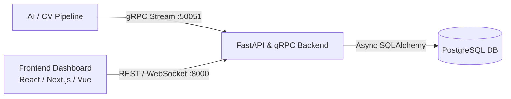

# Frontend Developer Integration Guide
**Customer Flow & Waiting Time Analytics Dashboard**

---

## 1. Overview & Architecture

This backend processes real-time AI/Computer Vision events from surveillance and camera feeds, storing customer journeys (entry, exit, demographics, emotion sentiment) and queue/waiting time metrics.

### System Architecture


### Local Development Ports
- **FastAPI REST API**: `http://localhost:8000`
- **gRPC Server**: `localhost:50051` (ML ingestion)
- **PostgreSQL**: `localhost:5433` (Docker host port)

---

## 2. Backend Data Models

The backend persists two primary data models defined in SQLAlchemy:

### A. Customer Flow (`Entry` Model)
Represents a customer's journey from store entry to exit, including facial analytics, demographics, and emotional sentiment.

| Field | Type | Description |
| :--- | :--- | :--- |
| `uuid` | `string (UUID)` | Unique record ID |
| `entry_time` | `ISO 8601 Timestamp` | Timestamp when the customer entered |
| `entry_count` | `number \| null` | Entry sequence counter / tracking index |
| `age_class` | `string \| null` | Estimated age group (e.g., `"18-25"`, `"26-35"`, `"36-50"`, `"50+"`) |
| `gender` | `string \| null` | Estimated gender (`"Male"`, `"Female"`) |
| `gender_conf` | `number \| null` | Model confidence for gender (e.g. `0.94`) |
| `enter_emotion` | `string \| null` | Emotion detected at entry (e.g., `"happy"`, `"neutral"`, `"sad"`, `"angry"`) |
| `enter_emotion_conf` | `number \| null` | Confidence for enter emotion (e.g. `0.88`) |
| `entry_face_box` | `string (JSON array)` | Normalized bounding box `[ymin, xmin, ymax, xmax]` |
| `entry_face_vector` | `string (JSON array)` | Face feature embedding vector |
| `exit_time` | `ISO 8601 Timestamp \| null` | Timestamp when the customer exited (`null` if still inside) |
| `exit_count` | `number \| null` | Exit sequence counter |
| `exit_emotion` | `string \| null` | Emotion detected at exit |
| `exit_emotion_conf` | `number \| null` | Confidence for exit emotion |
| `exit_face_box` | `string (JSON array)` | Exit face bounding box coordinates |
| `exit_face_vector` | `string (JSON array)` | Exit face embedding vector |
| `face_match_score` | `number \| null` | Similarity score matching entry & exit faces (e.g. `0.92`) |

---

### B. Waiting Time (`WaitingTime` Model)
Tracks queue sessions, checkout wait times, or zone dwell durations.

| Field | Type | Description |
| :--- | :--- | :--- |
| `uuid` | `string (UUID)` | Unique record ID |
| `id` | `number \| null` | Tracking session / Person ID |
| `entry_frame` | `number \| null` | Video frame index at queue entry |
| `exit_frame` | `number \| null` | Video frame index at queue exit |
| `entry_time` | `string \| null` | Formatted entry timestamp or time string |
| `exit_time` | `string \| null` | Formatted exit timestamp or time string |
| `duration` | `string \| null` | Human-readable duration (e.g. `"00:03:45"`) |
| `duration_s` | `number \| null` | Wait duration in total seconds (e.g. `225.5`) |

---

## 3. TypeScript Interfaces

Copy and paste these types directly into your frontend project (e.g., `types/analytics.ts`):

```typescript
export interface CustomerEntry {
  uuid: string;
  entry_time: string | null;
  entry_count: number | null;
  age_class: string | null;
  gender: 'Male' | 'Female' | string | null;
  gender_conf: number | null;
  enter_emotion: 'happy' | 'neutral' | 'sad' | 'surprised' | 'angry' | string | null;
  enter_emotion_conf: number | null;
  entry_face_box?: number[] | null;
  exit_time: string | null;
  exit_count: number | null;
  exit_emotion: string | null;
  exit_emotion_conf: number | null;
  face_match_score: number | null;
  // Computed / UI helpers:
  is_currently_inside?: boolean;
  dwell_time_seconds?: number | null;
}

export interface WaitingTimeSession {
  uuid: string;
  id: number | null;
  entry_frame: number | null;
  exit_frame: number | null;
  entry_time: string | null;
  exit_time: string | null;
  duration: string | null;
  duration_s: number | null;
}

export interface DashboardKPISummary {
  total_visitors_today: number;
  currently_in_store: number;
  avg_dwell_time_seconds: number;
  avg_waiting_time_seconds: number;
  customer_satisfaction_score: number; // e.g. % positive exit emotions
}

export interface DemographicStats {
  gender_distribution: { gender: string; count: number; percentage: number }[];
  age_distribution: { age_class: string; count: number }[];
}

export interface EmotionSentimentComparison {
  emotion: string;
  entry_count: number;
  exit_count: number;
}
```

---

## 4. API Endpoints Specification

### Base URL: `http://localhost:8000`

### 1. Health Check
- **Endpoint**: `GET /health`
- **Response**: `{"status": "ok"}`

### 2. Customer Flow / Entries
- **Endpoint**: `GET /api/v1/entries`
- **Query Parameters**:
  - `page` (default: 1): Page number
  - `limit` (default: 20): Items per page
  - `status`: `"inside"` | `"exited"` | `"all"`
  - `gender`: `"Male"` | `"Female"`
  - `date_from`: ISO Date String (`2026-08-01T00:00:00Z`)
  - `date_to`: ISO Date String (`2026-08-31T23:59:59Z`)
- **Response**:
```json
{
  "total": 150,
  "page": 1,
  "limit": 20,
  "data": [
    {
      "uuid": "8c5e2194-d2e8-4687-9bb3-5a02e6eec285",
      "entry_time": "2026-08-26T08:30:15Z",
      "entry_count": 101,
      "age_class": "25-35",
      "gender": "Female",
      "gender_conf": 0.96,
      "enter_emotion": "neutral",
      "enter_emotion_conf": 0.89,
      "exit_time": "2026-08-26T08:47:30Z",
      "exit_count": 98,
      "exit_emotion": "happy",
      "exit_emotion_conf": 0.92,
      "face_match_score": 0.94
    }
  ]
}
```

### 3. Waiting Times / Queue Sessions
- **Endpoint**: `GET /api/v1/waiting-times`
- **Query Parameters**: `limit`, `page`, `min_duration_s`
- **Response**:
```json
{
  "total": 85,
  "page": 1,
  "limit": 20,
  "data": [
    {
      "uuid": "3fa85f64-5717-4562-b3fc-2c963f66afa6",
      "id": 12,
      "entry_frame": 1500,
      "exit_frame": 4200,
      "entry_time": "09:15:00",
      "exit_time": "09:18:45",
      "duration": "00:03:45",
      "duration_s": 225.0
    }
  ]
}
```

### 4. Dashboard KPIs & Analytics
- **Endpoint**: `GET /api/v1/analytics/summary`
- **Endpoint**: `GET /api/v1/analytics/demographics`
- **Endpoint**: `GET /api/v1/analytics/emotions`

---

## 5. Recommended Frontend Tech Stack & Libraries

1. **Framework**: React 18+ / Next.js 14+ (App Router) / Vite + React
2. **Styling & Components**: Tailwind CSS + `shadcn/ui`
3. **Data Fetching & State**: `@tanstack/react-query` or `swr` (handles auto-polling, cache & loading states)
4. **Data Visualization / Charts**:
   - `recharts` or `tremor` (ideal for metrics & dashboards)
5. **Icons**: `lucide-react`
6. **Date Formatting**: `date-fns` or `dayjs`

---

## 6. Suggested UI Dashboard Layout & Features

### Screen 1: Real-Time Executive Overview
- **Metric Cards (KPIs)**:
  - 👥 **Current Live Occupancy**: Number of customers inside (`exit_time === null`).
  - 🚶 **Total Daily Entries**: Total customer count for current day.
  - ⏱️ **Average Dwell Time**: Average difference between `exit_time` and `entry_time`.
  - ⏳ **Average Queue Wait Time**: Average `duration_s` from waiting sessions.
  - 😊 **Satisfaction Index**: % of customers exiting with positive emotion compared to entry.
- **Real-Time Activity Stream**: Live feed displaying newly detected entries/exits as they happen.

### Screen 2: Demographics & Customer Intelligence
- **Gender Breakdown**: Donut / Pie chart with confidence intervals.
- **Age Distribution**: Bar chart comparing age groups (`<18`, `18-25`, `25-35`, `35-50`, `50+`).
- **Peak Hours Heatmap**: Entry traffic heatmap grouped by hour of the day and day of week.

### Screen 3: Sentiment & Experience Analytics
- **Entry vs Exit Emotion Comparison**: Grouped column chart displaying emotions (`happy`, `neutral`, `sad`, `surprised`, `angry`).
- **Emotion Conversion / Delta**: Tracks customer satisfaction shift during their visit.

### Screen 4: Queue & Waiting Time Performance
- **Queue Duration Trend**: Area chart showing hourly average wait times against acceptable SLA thresholds (e.g. alert if wait time > 5 mins).

### Screen 5: Visitors Log & Audit Table
- Data table with search, date-range picker, filter by gender/emotion, status badge (`Inside` vs `Exited`), and pagination.

---

## 7. Frontend Integration Example Code

### A. Environment Configuration (`.env.local`)
```env
NEXT_PUBLIC_API_URL=http://localhost:8000
# Or for Vite:
# VITE_API_URL=http://localhost:8000
```

### B. API Client (`lib/api.ts`)
```typescript
import axios from 'axios';

export const apiClient = axios.create({
  baseURL: process.env.NEXT_PUBLIC_API_URL || 'http://localhost:8000',
  headers: {
    'Content-Type': 'application/json',
  },
});
```

### C. Live Polling Hook using TanStack Query
```typescript
import { useQuery } from '@tanstack/react-query';
import { apiClient } from '@/lib/api';
import { CustomerEntry } from '@/types/analytics';

export function useCustomerEntries() {
  return useQuery({
    queryKey: ['customer-entries'],
    queryFn: async () => {
      const response = await apiClient.get<{ data: CustomerEntry[] }>('/api/v1/entries');
      return response.data.data;
    },
    // Auto-refresh every 5 seconds for live dashboard updates:
    refetchInterval: 5000,
  });
}
```

---

## 8. Backend Configuration Note for Frontend Devs

### Enabling CORS in FastAPI
If calling the backend directly from a browser (`localhost:3000` / `localhost:5173`), ensure CORS middleware is configured in the FastAPI backend (`app/main.py`):

```python
from fastapi.middleware.cors import CORSMiddleware

app.add_middleware(
    CORSMiddleware,
    allow_origins=["http://localhost:3000", "http://localhost:5173", "*"],
    allow_credentials=True,
    allow_methods=["*"],
    allow_headers=["*"],
)
```
