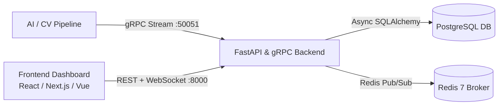

# Frontend Developer Integration Guide & Contract
**Customer Flow & Waiting Time Analytics Dashboard**


## 1. Overview & Architecture

This backend processes real-time AI/Computer Vision events from surveillance and camera feeds, storing customer journeys (entry, exit, demographics, emotion sentiment) and queue/waiting time metrics.

### System Architecture


### Local Development Ports
- **FastAPI REST & WebSocket**: `http://localhost:8000` (WS: `ws://localhost:8000`)
- **gRPC Server**: `localhost:50051` (ML ingestion)
- **PostgreSQL**: `localhost:5433` (Docker host port)
- **Redis**: `localhost:6379` (Docker host port)

---

## 2. Authentication & Real-Time Flow Contract

The frontend interacts with the backend using a two-step flow:

1. **Standard REST Endpoints**: Authenticated via standard `Authorization: Bearer <JWT_ACCESS_TOKEN>` headers.
2. **Real-Time WebSocket Stream**:
   - Step 1: Frontend calls `POST /api/v1/dashboard/{branch_id}/ws/ticket` (or `POST /api/v1/dashboard/ws/ticket`) with the Bearer JWT.
   - Step 2: Backend validates JWT and returns an opaque, single-use ticket (`{ "ticket": "..." }`).
   - Step 3: Frontend opens `new WebSocket("ws://localhost:8000/ws/dashboard/branch-1?ticket=" + ticket)`.
   - Step 4: Backend sends the current `dashboard_snapshot` state immediately upon connection, then streams live `dashboard_update` events over Redis Pub/Sub.
   - Step 5: On reconnect, frontend **always mints a fresh ticket** via HTTP POST. Old tickets are single-use and cannot be replayed.

---

## 3. TypeScript Interfaces (`types/analytics.ts`)

Copy and paste these types directly into your frontend project:

```typescript
export interface EmotionTransitions {
  natural_to_angry: number;
  angry_to_natural: number;
  natural_to_natural: number;
  angry_to_angry: number;
}

export interface LongestStay {
  entry_time: string | null;
  exit_time: string | null;
  duration_seconds: number | null;
  customer_id: string | null;
  entry_count: number | null;
  branch_id: string | null;
  camera_id: string | null;
}

export interface HighestOccupancyPeriod {
  start: string | null;
  end: string | null;
  occupancy: number;
}

export interface DashboardMetrics {
  people_in_store: number;
  total_entries_today: number;
  total_exits_today: number;
  emotion_transitions: EmotionTransitions;
  longest_stay: LongestStay | null;
  highest_occupancy_period: HighestOccupancyPeriod | null;
}

export interface DashboardEvent {
  type: 'dashboard_snapshot' | 'dashboard_update';
  timestamp: string;
  branch_id: string | null;
  data: DashboardMetrics;
}

export interface OccupancyBucket {
  start: string;
  end: string;
  occupancy: number;
}

export interface OccupancyTimelineResponse {
  bucket: string;
  date: string;
  branch_id: string | null;
  peak_period: HighestOccupancyPeriod | null;
  timeline: OccupancyBucket[];
}

export interface CustomerEntry {
  uuid: string;
  entry_time: string | null;
  entry_count: number | null;
  age_class: string | null;
  gender: 'Male' | 'Female' | string | null;
  gender_conf: number | null;
  enter_emotion: string | null;
  enter_emotion_conf: number | null;
  entry_face_box?: string | null;
  entry_face_vector?: string | null;
  exit_time: string | null;
  exit_count: number | null;
  exit_emotion: string | null;
  exit_emotion_conf: number | null;
  exit_face_box?: string | null;
  exit_face_vector?: string | null;
  face_match_score: number | null;
  branch_id: string | null;
  camera_id: string | null;
  // UI computed helpers:
  is_currently_inside?: boolean;
  dwell_time_seconds?: number | null;
}

export interface PaginatedResponse<T> {
  total: number;
  page: number;
  limit: number;
  data: T[];
}

export interface WaitingTimeSession {
  uuid: string;
  id: number | null;
  entry_frame: number | null;
  exit_frame: number | null;
  entry_time: string | null;
  exit_time: string | null;
  duration: string | null;
  duration_s: number | null;
}
```

---

## 4. API Endpoints Specification & Contract

| Endpoint | Method | Required Permission | Description |
| :--- | :--- | :--- | :--- |
| `/health` | `GET` | *Public* | Health check (`{"status": "ok"}`) |
| `/api/v1/dashboard/ws/ticket` | `POST` | `analytics:read` | Mint single-use WebSocket ticket for global dashboard |
| `/api/v1/dashboard/{branch_id}/ws/ticket` | `POST` | `analytics:read` | Mint single-use WebSocket ticket for branch dashboard |
| `/api/dashboard/metrics` | `GET` | `analytics:read` | Live/historical KPI metrics |
| `/api/v1/analytics/summary` | `GET` | `analytics:read` | Daily KPI summary metrics |
| `/api/v1/analytics/occupancy` | `GET` | `analytics:read` | Occupancy timeline and peak traffic period |
| `/api/v1/analytics/emotions` | `GET` | `analytics:read` | Sentiment emotion transitions |
| `/api/v1/entries` | `GET` | `entries:read` | Paginated customer entries with filters |
| `/api/v1/waiting-times` | `GET` | `waiting_times:read` | Paginated queue wait durations |
| `/ws/dashboard` | `WS` | Single-use Ticket | Real-time global dashboard WebSocket stream |
| `/ws/dashboard/{branch_id}` | `WS` | Single-use Ticket | Real-time branch-specific WebSocket stream |

---

## 5. Ready-to-Use Frontend Integration Code

### A. Environment Configuration (`.env.local`)
```env
NEXT_PUBLIC_API_URL=http://localhost:8000
NEXT_PUBLIC_WS_URL=ws://localhost:8000
```

### B. Authenticated API Client (`lib/api.ts`)
```typescript
import axios from 'axios';

export const apiClient = axios.create({
  baseURL: process.env.NEXT_PUBLIC_API_URL || 'http://localhost:8000',
  headers: {
    'Content-Type': 'application/json',
  },
});

apiClient.interceptors.request.use((config) => {
  const token = typeof window !== 'undefined' ? localStorage.getItem('access_token') : null;
  if (token && config.headers) {
    config.headers.Authorization = `Bearer ${token}`;
  }
  return config;
});
```

### C. REST Query Hooks using TanStack Query (`hooks/useAnalytics.ts`)
```typescript
import { useQuery } from '@tanstack/react-query';
import { apiClient } from '@/lib/api';
import {
  CustomerEntry,
  DashboardMetrics,
  OccupancyTimelineResponse,
  PaginatedResponse,
  WaitingTimeSession,
} from '@/types/analytics';

// 1. Dashboard Metrics Summary
export function useDashboardMetrics(branchId?: string, date?: string) {
  return useQuery({
    queryKey: ['dashboard-metrics', branchId, date],
    queryFn: async () => {
      const response = await apiClient.get<DashboardMetrics>('/api/dashboard/metrics', {
        params: { branch_id: branchId, date },
      });
      return response.data;
    },
  });
}

// 2. Occupancy Timeline
export function useOccupancyTimeline(branchId?: string, date?: string, bucket: string = '1h') {
  return useQuery({
    queryKey: ['occupancy-timeline', branchId, date, bucket],
    queryFn: async () => {
      const response = await apiClient.get<OccupancyTimelineResponse>('/api/v1/analytics/occupancy', {
        params: { branch_id: branchId, date, bucket },
      });
      return response.data;
    },
  });
}

// 3. Paginated Customer Entries
export function useCustomerEntries(params?: {
  page?: number;
  limit?: number;
  status?: 'inside' | 'exited' | 'all';
  gender?: string;
  branch_id?: string;
}) {
  return useQuery({
    queryKey: ['customer-entries', params],
    queryFn: async () => {
      const response = await apiClient.get<PaginatedResponse<CustomerEntry>>('/api/v1/entries', {
        params,
      });
      return response.data;
    },
  });
}

// 4. Paginated Queue Waiting Times
export function useWaitingTimes(params?: { page?: number; limit?: number; min_duration_s?: number }) {
  return useQuery({
    queryKey: ['waiting-times', params],
    queryFn: async () => {
      const response = await apiClient.get<PaginatedResponse<WaitingTimeSession>>('/api/v1/waiting-times', {
        params,
      });
      return response.data;
    },
  });
}
```

### D. Production-Grade WebSocket Real-Time Hook (`hooks/useRealtimeDashboard.ts`)
```typescript
import { useEffect, useRef, useState } from 'react';
import { apiClient } from '@/lib/api';
import { DashboardEvent, DashboardMetrics } from '@/types/analytics';

export function useRealtimeDashboard(branchId?: string) {
  const [metrics, setMetrics] = useState<DashboardMetrics | null>(null);
  const [isConnected, setIsConnected] = useState<boolean>(false);
  const [error, setError] = useState<string | null>(null);
  const wsRef = useRef<WebSocket | null>(null);
  const reconnectTimeoutRef = useRef<NodeJS.Timeout | null>(null);

  useEffect(() => {
    let isCancelled = false;

    async function connect() {
      try {
        setError(null);

        // Step 1: Mint a single-use opaque ticket via authenticated HTTP POST
        const ticketUrl = branchId
          ? `/api/v1/dashboard/${branchId}/ws/ticket`
          : `/api/v1/dashboard/ws/ticket`;

        const { data } = await apiClient.post<{ ticket: string }>(ticketUrl);
        if (isCancelled) return;

        // Step 2: Build WebSocket URL
        const wsProtocol = window.location.protocol === 'https:' ? 'wss:' : 'ws:';
        const wsBase = process.env.NEXT_PUBLIC_WS_URL || `${wsProtocol}//${window.location.host}`;
        const wsPath = branchId ? `/ws/dashboard/${branchId}` : `/ws/dashboard`;
        const wsUrl = `${wsBase}${wsPath}?ticket=${encodeURIComponent(data.ticket)}`;

        const socket = new WebSocket(wsUrl);
        wsRef.current = socket;

        socket.onopen = () => {
          if (!isCancelled) {
            setIsConnected(true);
            setError(null);
          }
        };

        socket.onmessage = (event) => {
          try {
            const payload: DashboardEvent = JSON.parse(event.data);
            if (payload && payload.data && !isCancelled) {
              setMetrics(payload.data);
            }
          } catch (err) {
            console.error('Failed to parse WebSocket message frame:', err);
          }
        };

        socket.onerror = (err) => {
          console.warn('WebSocket encountered error:', err);
        };

        socket.onclose = (event) => {
          if (isCancelled) return;
          setIsConnected(false);
          wsRef.current = null;

          // If closed abnormally (e.g. 1013 Try Again Later or network blip),
          // reconnect by requesting a BRAND NEW ticket
          if (event.code !== 1000) {
            console.info(`WebSocket closed (code: ${event.code}). Reconnecting in 3s with a fresh ticket...`);
            reconnectTimeoutRef.current = setTimeout(connect, 3000);
          }
        };
      } catch (err: any) {
        if (!isCancelled) {
          setError(err?.response?.data?.detail || 'Failed to authenticate WebSocket ticket');
          reconnectTimeoutRef.current = setTimeout(connect, 5000);
        }
      }
    }

    connect();

    return () => {
      isCancelled = true;
      if (reconnectTimeoutRef.current) clearTimeout(reconnectTimeoutRef.current);
      if (wsRef.current) {
        wsRef.current.close(1000, 'Component unmounted');
        wsRef.current = null;
      }
    };
  }, [branchId]);

  return { metrics, isConnected, error };
}
```

---

## 6. Suggested UI Dashboard Layout & Feature Components

### Screen 1: Executive Overview Dashboard
* **Live KPI Metric Cards**:
  * 👥 **People Currently Inside**: `metrics.people_in_store` (Live WebSocket update)
  * 🚶 **Total Daily Entries**: `metrics.total_entries_today`
  * 🚪 **Total Daily Exits**: `metrics.total_exits_today`
  * ⏱️ **Longest Customer Stay**: `metrics.longest_stay.duration_seconds` (Formatted e.g. "1h 30m")
  * 📈 **Peak Occupancy Period**: `metrics.highest_occupancy_period.occupancy`
* **Real-Time Sentiment Transition Radar / Bar**:
  * `metrics.emotion_transitions.natural_to_angry`
  * `metrics.emotion_transitions.angry_to_natural`
  * `metrics.emotion_transitions.natural_to_natural`
  * `metrics.emotion_transitions.angry_to_angry`

### Screen 2: Occupancy Timeline Chart
* Area / Bar Chart displaying concurrent occupancy per 15m/1h interval.

### Screen 3: Customer Journey & Demographics Audit Table
* Data table with search, gender filtering, inside/exited status badge, and date picker.

### Screen 4: Queue & Waiting Time Performance
* Average queue dwell duration vs SLA threshold alarms.
